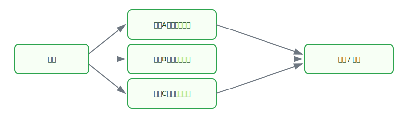

# SQL Server SSIS 数据流研究：串联、并联与基础操作

## 1. 研究背景与目标
在 SQL Server Integration Services（SSIS）中，数据流（Data Flow）决定了数据抽取、清洗、转换与加载（ETL）的效率与稳定性。  
本文聚焦三个核心问题：

1. **串联执行（Serial）**：如何保证步骤按顺序、可追踪地完成；
2. **并联执行（Parallel）**：如何提升吞吐量并控制资源竞争；
3. **基础操作（Basic Operations）**：数据源、转换、目标与常见控制策略。

---

## 2. 数据流整体结构（图文并行）

| 示意图 | 说明 |
|---|---|
|  | SSIS 数据流通常遵循“**输入 -> 处理 -> 输出**”路径。输入端负责连接源系统；中间通过转换组件清洗和增强数据；输出端将结果写入数据库、文件或其他系统。|

---

## 3. 串联执行：稳定、可控、便于定位问题

### 3.1 适用场景
- 后续步骤依赖前一步输出；
- 业务规则严格要求先后顺序；
- 需要更清晰的错误定位链路。

### 3.2 串联执行示意（图文并行）

| 示意图 | 说明 |
|---|---|
|  | 串联通过优先约束（Precedence Constraint）形成“前置完成后再执行下一步”的链式流程。优点是执行路径清晰、结果可预测；代价是总耗时可能增加。|

### 3.3 关键实践
- 使用 `On Success` 约束保证流程稳定推进；
- 对每一步设置日志与错误输出；
- 对高风险转换先小批量验证，再扩大数据量。

---

## 4. 并联执行：提升吞吐，但要管理并发成本

### 4.1 适用场景
- 多路数据互不依赖；
- 服务器具备充足 CPU / 内存 / I/O；
- 目标系统支持并发写入。

### 4.2 并联执行示意（图文并行）

| 示意图 | 说明 |
|---|---|
|  | 并联通过多个可独立执行的数据流同时运行来缩短总处理时间。核心风险是资源竞争（锁、I/O、内存压力）与下游写入冲突。|

### 4.3 关键实践
- 在包级别合理设置 `MaxConcurrentExecutables`；
- 按资源瓶颈拆分并发层级（CPU 密集与 I/O 密集分开）；
- 对目标表采用分区、批量提交与重试策略降低冲突。

---

## 5. SSIS 数据流基础操作（按执行链路递进）

1. **连接管理器（Connection Managers）**  
   统一管理 SQL Server、Flat File、OLE DB 等连接信息。

2. **数据源（Source）**  
   读取表、视图或查询结果；建议在源端尽量过滤无效数据，减少后续负担。

3. **常见转换（Transformations）**  
   - `Derived Column`：新增或修正字段；
   - `Lookup`：维表匹配、编码补全；
   - `Conditional Split`：按规则分流；
   - `Data Conversion`：统一数据类型；
   - `Aggregate / Sort`：聚合与排序（注意内存占用）。

4. **目标（Destination）**  
   通过 OLE DB Destination 等组件装载数据，优先考虑批量写入与错误行重定向。

5. **错误处理与监控**  
   配置 Error Output、日志与告警；将失败记录落地，便于补录与回溯。

---

## 6. 串联与并联的组合策略

- **先串后并**：先做统一清洗，再分主题并行装载；
- **先并后串**：多源并行抽取后，在统一阶段进行汇总校验；
- **分层设计**：将“抽取层、转换层、装载层”拆分，逐层控制并发。

> 实务建议：先做串联保证正确性，再逐步引入并联优化性能，避免“一开始就高并发”导致排障困难。

---

## 7. 结论
SSIS 数据流设计的核心不在“串联或并联二选一”，而在于**基于依赖关系与资源约束做组合优化**。  
以稳定性为底线、以吞吐量为目标、以可观测性为保障，才能构建可持续演进的数据集成流程。
