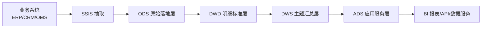

# SQL Server + SSIS 数据流全链路实践：从建表分层到存储过程、视图与调度运维

> 目标：让读者看完后，不仅知道 SSIS 串联/并联，还能真正理解 SQL Server 数据如何在企业中“流动、加工、沉淀、服务”。

---

## 目录

- [1. 你将获得什么](#1-你将获得什么)
- [2. 全景架构：数据是如何流动的](#2-全景架构数据是如何流动的)
- [3. SQL Server 运行逻辑：表/视图/存储过程/作业如何协作](#3-sql-server-运行逻辑表视图存储过程作业如何协作)
- [4. 分层建表：ODS/DWD/DWS/ADS 的设计与示例](#4-分层建表odsdwddwsads-的设计与示例)
- [5. SSIS 运行机制：控制流 + 数据流 + 串并联](#5-ssis-运行机制控制流--数据流--串并联)
- [6. 端到端实战：订单主题 ETL 全流程](#6-端到端实战订单主题-etl-全流程)
- [7. 增量加载、一致性、幂等与补数](#7-增量加载一致性幂等与补数)
- [8. 性能优化：SQL Server �� SSIS 双视角](#8-性能优化sql-server-与-ssis-双视角)
- [9. 可观测性与运维：日志、告警、SLA](#9-可观测性与运维日志告警sla)
- [10. 常见故障与排查路径](#10-常见故障与排查路径)
- [11. 最佳实践与反模式](#11-最佳实践与反模式)
- [12. 订单主题 ETL 串并联执行蓝图（任务图 + 参数建议 + 故障回滚策略）](#section-12-etl-blueprint)
- [13. 总结](#13-总结)

---

## 1. 你将获得什么

读完本文，你应该能够：

1. 画出 SQL Server 数据在企业里的典型流向图；
2. 解释为什么要做分层建模（ODS/DWD/DWS/ADS）；
3. 明确表、视图、存储过程、SQL Agent、SSIS 各自职责；
4. 独立搭建一条“可运行、可监控、可重跑”的 ETL 流程；
5. 处理常见问题：并发冲突、性能慢、重复入库、口径不一致。

---

## 2. 全景架构：数据是如何流动的

在真实项目中，数据通常不是“直接从源表到报表”，而是经过分层加工。



### 2.1 每一层的目标

- **ODS（Operational Data Store）原始层**  
  目标：保留源系统“原貌”，便于追溯。  
  特点：轻转换、强审计、保留技术字段（批次号、加载时间、来源系统）。

- **DWD（Data Warehouse Detail）明细层**  
  目标：标准化清洗，形成可信明细事实。  
  特点：字段统一、类型统一、去重、业务键规范。

- **DWS（Data Warehouse Summary）汇总层**  
  目标：主题化聚合，提升分析效率。  
  特点：按天/周/月聚合，统一指标口径。

- **ADS（Application Data Service）应用层**  
  目标：直接服务报表、接口、应用。  
  特点：高性能、稳定口径、面向消费场景。

---

## 3. SQL Server 运行逻辑：表/视图/存储过程/作业如何协作

很多初学者只关注“怎么写 SQL”，但工程上更重要的是“对象如何协作”。

### 3.1 表（Table）：数据持久化载体

- ODS 表：尽量贴近源表结构；
- DWD 表：清洗后的标准事实明细；
- DWS 表：按主题聚合的统计表；
- ADS 表或视图：供前台直接查询。

关键点：
- 主键/唯一约束：避免重复；
- 索引设计：支持高频查询和更新；
- 分区策略：大表按日期分区；
- 技术字段：`etl_batch_id`、`etl_load_time`、`is_deleted`。

### 3.2 视图（View）：解耦与统一口径

视图用于：
- 隐藏底层复杂 Join；
- 向报表层暴露稳定接口；
- 做权限隔离（只给视图查询权限）；
- 在 ADS 层固化指标定义，避免每个报表重复计算。

### 3.3 存储过程（Stored Procedure）：可控执行单元

为什么 ETL 常用存储过程？
- 参数化（全量/增量、日期范围）；
- 事务控制（成功提交、失败回滚）；
- 错误捕获（TRY...CATCH）；
- 便于调度（SQL Agent 调一次过程即可）。

### 3.4 SQL Agent 作业（Job）：调度中枢

作业一般分为多个 Step：
1. 预检查（依赖检测、锁检测）；
2. 执行 SSIS 包或存储过程；
3. 后处理（对账、刷新统计、写日志）；
4. 失败重试与告警。

---

## 4. 分层建表：ODS/DWD/DWS/ADS 的设计与示例

> 以下示例是“订单主题”的简化设计。

### 4.1 ODS：原始落地表

```sql
-- ODS 订单原始表
CREATE TABLE ods.orders_raw (
    src_order_id        NVARCHAR(50)  NOT NULL,
    src_customer_id     NVARCHAR(50)  NULL,
    order_time          DATETIME2     NULL,
    order_status        NVARCHAR(30)  NULL,
    total_amount        DECIMAL(18,2) NULL,
    src_last_update_time DATETIME2    NULL,

    etl_batch_id        BIGINT        NOT NULL,
    etl_load_time       DATETIME2     NOT NULL DEFAULT SYSDATETIME(),
    src_system          NVARCHAR(30)  NOT NULL,
    row_hash            VARBINARY(32) NULL
);
```

设计原则：
- 保留源字段命名习惯（必要时加注释）；
- 不做重业务逻辑；
- 必加审计字段，支持追溯与重跑。

### 4.2 DWD：明细标准表

```sql
CREATE TABLE dwd.fact_order_detail (
    order_id            BIGINT         NOT NULL,
    customer_id         BIGINT         NOT NULL,
    order_date          DATE           NOT NULL,
    order_status_code   INT            NOT NULL,
    total_amount        DECIMAL(18,2)  NOT NULL,
    is_valid            BIT            NOT NULL DEFAULT 1,

    etl_batch_id        BIGINT         NOT NULL,
    etl_load_time       DATETIME2      NOT NULL DEFAULT SYSDATETIME(),
    CONSTRAINT PK_fact_order_detail PRIMARY KEY CLUSTERED (order_id)
);
```

设计原则：
- 字段类型标准化；
- 枚举值编码化（如状态码）；
- 明确主键策略；
- 可附加维度外键（视项目需要）。

### 4.3 DWS：汇总主题表

```sql
CREATE TABLE dws.sales_day (
    sales_date          DATE           NOT NULL,
    order_cnt           BIGINT         NOT NULL,
    customer_cnt        BIGINT         NOT NULL,
    gross_amount        DECIMAL(18,2)  NOT NULL,
    avg_order_amount    DECIMAL(18,2)  NOT NULL,
    etl_batch_id        BIGINT         NOT NULL,
    etl_load_time       DATETIME2      NOT NULL DEFAULT SYSDATETIME(),
    CONSTRAINT PK_sales_day PRIMARY KEY CLUSTERED (sales_date)
);
```

### 4.4 ADS：应用输出视图

```sql
CREATE VIEW ads.v_sales_dashboard
AS
SELECT
    sales_date,
    order_cnt,
    customer_cnt,
    gross_amount,
    avg_order_amount
FROM dws.sales_day;
GO
```

---

## 5. SSIS 运行机制：控制流 + 数据流 + 串并联

## 5.1 控制流（Control Flow）

控制流负责“执行顺序与调度控制”，常见组件：
- **Execute SQL Task**：执行存储过程、预处理 SQL；
- **Data Flow Task**：真正的数据抽取与转换；
- **Sequence Container**：把一组任务打包控制；
- **ForEach Loop**：遍历文件、分区、日期批次；
- **Precedence Constraint**：定义任务间条件关系。

约束类型：
- `On Success`：前一步成功才执行下一步；
- `On Failure`：失败时走异常分支；
- `Expression`：按表达式判断（如批次是否为空）。

## 5.2 数据流（Data Flow）

典型链路：

```text
Source -> Data Conversion -> Derived Column -> Lookup -> Conditional Split -> Destination
```

核心组件说明：
- **Source**：读取 SQL/文件；
- **Data Conversion**：统一字段类型；
- **Derived Column**：衍生字段（如日期键、业务标签）；
- **Lookup**：维表映射（编码转标准键）；
- **Conditional Split**：按规则分流（正常/异常）；
- **Destination**：落地目标表。

## 5.3 串联与并联如何选

- **串联（Serial）**：存在依赖关系时使用。优点是稳定、容易排查；
- **并联（Parallel）**：互不依赖时使用。优点是吞吐高。

并联关键参数：
- `MaxConcurrentExecutables`（包级并发控制）；
- 数据库端连接池/锁资源；
- 目标表写入策略（批量、分区、重试）。

建议路径：**先串联保正确，再逐步并联提性能**。

---

## 6. 端到端实战：订单主题 ETL 全流程

这里给出一条“可执行思路”。

### 6.1 Step 1：抽取到 ODS

- 从 `erp.orders` 读取最近变更数据；
- 写入 `ods.orders_raw`；
- 写入批次号与加载时间。

### 6.2 Step 2：ODS -> DWD 清洗标准化

- 去重：同一业务键取最新记录；
- 空值处理：关键字段默认值/拒收；
- 状态映射：文本状态转状态码；
- 主键合法性校验。

示例（去重）：

```sql
WITH cte AS (
    SELECT
        src_order_id,
        src_customer_id,
        order_time,
        order_status,
        total_amount,
        etl_batch_id,
        etl_load_time,
        ROW_NUMBER() OVER (
            PARTITION BY src_order_id
            ORDER BY src_last_update_time DESC, etl_load_time DESC
        ) AS rn
    FROM ods.orders_raw
)
INSERT INTO dwd.fact_order_detail (
    order_id, customer_id, order_date, order_status_code, total_amount, etl_batch_id, etl_load_time
)
SELECT
    TRY_CAST(src_order_id AS BIGINT) AS order_id,
    TRY_CAST(src_customer_id AS BIGINT) AS customer_id,
    CAST(order_time AS DATE) AS order_date,
    CASE order_status
        WHEN N'CREATED' THEN 1
        WHEN N'PAID' THEN 2
        WHEN N'CANCELLED' THEN 9
        ELSE 0
    END AS order_status_code,
    ISNULL(total_amount, 0) AS total_amount,
    etl_batch_id,
    SYSDATETIME()
FROM cte
WHERE rn = 1;
```

### 6.3 Step 3：DWD -> DWS 汇总

```sql
INSERT INTO dws.sales_day (
    sales_date, order_cnt, customer_cnt, gross_amount, avg_order_amount, etl_batch_id, etl_load_time
)
SELECT
    order_date AS sales_date,
    COUNT(1) AS order_cnt,
    COUNT(DISTINCT customer_id) AS customer_cnt,
    SUM(total_amount) AS gross_amount,
    AVG(total_amount) AS avg_order_amount,
    @batch_id,
    SYSDATETIME()
FROM dwd.fact_order_detail
WHERE order_date BETWEEN @start_date AND @end_date
GROUP BY order_date;
```

### 6.4 Step 4：发布 ADS 视图并供报表读取

- 报表只读 `ads.v_sales_dashboard`；
- 底层换表、调口径时尽量不影响上层报表。

---

## 7. 增量加载、一致性、幂等与补数

这是工程落地的关键。

### 7.1 增量策略

常见方式：
1. **时间戳增量**：`last_update_time > 上次水位`；
2. **CDC / Change Tracking**：捕获变更日志；
3. **业务流水号增量**：按递增主键拉取。

### 7.2 幂等设计（可重跑）

目标：同一批次重复执行不产生重复数据。

方法：
- 先删后插（按批次/日期分区）；
- `MERGE` / UPSERT；
- 唯一键约束 + 冲突处理。

### 7.3 一致性校验（对账）

至少做三类校验：
- 行数对账（源 vs ODS vs DWD）；
- 金额对账（汇总金额是否一致）；
- 主键唯一性校验（重复键检查）。

### 7.4 补数机制

- 支持按日期区间重跑；
- 支持单批次重跑；
- 保留失败明细与错误原因，便于定向修复。

---

## 8. 性能优化：SQL Server 与 SSIS 双视角

## 8.1 SQL Server 侧

- 建合理索引（不是越多越好）；
- 大表分区（按日期）；
- 更新统计信息；
- 检查执行计划，避免 Key Lookup 放大；
- 批量写入减少事务开销。

## 8.2 SSIS 侧

- 减少不必要的 Sort/Aggregate；
- 合理设置 DefaultBufferMaxRows / DefaultBufferSize；
- 目标端使用 Fast Load；
- 并行度与数据库承载能力匹配；
- 对慢组件做分段测试（定位瓶颈组件）。

---

## 9. 可观测性与运维：日志、告警、SLA

建议建立统一 ETL 日志表：

```sql
CREATE TABLE etl.etl_job_log (
    job_name            NVARCHAR(100) NOT NULL,
    batch_id            BIGINT        NOT NULL,
    start_time          DATETIME2     NOT NULL,
    end_time            DATETIME2     NULL,
    status              NVARCHAR(20)  NOT NULL, -- RUNNING/SUCCESS/FAILED
    rows_in             BIGINT        NULL,
    rows_out            BIGINT        NULL,
    error_message       NVARCHAR(MAX) NULL,
    created_at          DATETIME2     NOT NULL DEFAULT SYSDATETIME()
);
```

监控指标建议：
- 成功率；
- 平均耗时；
- 数据延迟（T+0 / T+1）；
- 重跑率；
- 对账差异率。

---

## 10. 常见故障与排查路径

1. **SSIS 包失败**  
   - 看包日志、组件错误输出；  
   - 判断是连接失败、转换失败、目标写入失败。

2. **数据重复**  
   - 检查唯一键与幂等策略；  
   - 检查是否重复调度。

3. **执行慢**  
   - 查 SQL 执行计划；  
   - 查锁等待与阻塞；  
   - 查 SSIS 哪个组件耗时高。

4. **口径不一致**  
   - 指标定义是否统一在 DWS/ADS；  
   - 报表是否绕过标准层直连明细表。

---

## 11. 最佳实践与反模式

### 11.1 最佳实践

- 先保证正确性，再做并发优化；
- 分层解耦，避免“全写在一个包里”；
- 统一指标口径，集中沉淀在 DWS/ADS；
- 日志与告警先行，避免“黑盒 ETL”。

### 11.2 反模式

- 一开始就高并发，出现故障难排查；
- 无批次号、无审计字段，无法追溯；
- 报表直连 ODS 或源系统，导致口径漂移；
- 只做成功链路，不做失败处理与补数机制。

---

<a id="section-12-etl-blueprint"></a>

## 12. 订单主题 ETL 串并联执行蓝图（任务图 + 参数建议 + 故障回滚策略）

这一节把“分层是目标、回流/分流是现实”落实为可执行规范。核心原则：**不是数据库自动判断语义，而是工程规则 + 依赖 DAG + 批次治理来判断与约束**。

### 12.1 任务图（串并联）

主干链路（必须串联）：

```text
T0 预检查(连接/锁/参数)
  -> T1 ODS 抽取
  -> T2 ODS 质量校验
  -> T3 DWD 标准化入仓
  -> T4 DWD 对账校验
  -> T5 DWS 聚合
  -> T6 ADS 发布
```

并联分组（仅在无依赖时并跑）：
- G1：订单域 DWD、会员域 DWD、商品域 DWD；
- G2：同一主题按 `data_date` 分片并行；
- G3：异常数据修复流与主链路并行，但只写隔离区。
- 并行判定标准：
  - 无写同一目标表；
  - 无分区重叠；
  - 无互斥锁依赖；
  - 无前后口径依赖（例如“先产出订单有效标识，再计算有效订单金额”这类先后计算关系不可并跑）；

发布门禁（T6 之前必须全部通过）：
- 行数校验通过（源/ODS/DWD）；
- 金额校验通过（明细汇总 vs 目标汇总）；
- 主键唯一性通过（重复键=0）；
- 批次状态一致（同一 `batch_id`）。

### 12.2 参数建议（先稳后快）

- 并发参数：先低并发，再逐步上调 `MaxConcurrentExecutables`；
- 批次参数：全链路统一 `batch_id` / `data_date` / `watermark`；
- 写入参数（性能）：大表按分区写入，目标端优先使用 SSIS OLE DB Destination 的 Data Access Mode=`Table or view - fast load`；
- 写入参数（约束）：如需逐行触发器或严格逐条约束校验，不建议使用 Fast Load；
- 发布策略：ADS 使用“影子表 + 原子切换”，避免直接覆盖；
- 重试策略：任务级短重试 + 批次级重跑分离，防止重复入库。

### 12.3 故障回滚策略（批次化）

批次状态机：

```text
READY -> RUNNING -> SUCCESS
                \-> FAILED
```

规则：
- 回滚粒度只到 `batch_id` 或 `data_date`；
- DWD/DWS 层允许“先删后灌”；
- ADS 层失败回滚到上一成功快照；
- 回滚后必须再次执行行数/金额/唯一键校验。

### 12.4 DWD 字段流向 ADS，且 ADS 新表依赖 ADS 同层过滤时怎么安排

推荐模式：**双来源、单发布口**。

- 来源 A：DWD（权威明细字段）；
- 来源 B：ADS 已发布稳定表（同层业务过滤条件）；
- 输出：仅发布到 ADS 正式对象（视图/正式表），不暴露中间态表。

硬约束：
- 只允许读取 ADS“发布态”对象；
- 同层依赖必须批次对齐（同 `batch_id` 或同 `data_date`）；
- 新 ADS 表发布前需登记字段血缘（字段来源、转换规则、责任人）。

### 12.5 回流 / 分流定义与治理

- 分流（允许）：一个上游产出多个下游（例如 DWD -> 多个 ADS 应用表）；
- 回流（默认禁止）：ADS 结果直接回写 DWD/ODS；
- 例外：必须反馈业务事实时，走独立反馈层（可命名为 FWD，Feedback Warehouse Data，仅为示例命名），该层仅用于承接下游反馈事件并经校验后再向上游受控回补，禁止污染原子明细层。

### 12.6 “数据库如何判断”的本质答案

数据库引擎只负责执行 SQL，不理解数仓分层语义。  
真正的判断来自治理机制：
- 依赖 DAG（前置成功才可执行后置）；
- 层级访问矩阵（定义“谁可以读谁”）；
- 批次对齐规则（同批次发布）；
- 血缘元数据（字段来源可追溯）；
- 质量门禁（校验不过不发布）。

### 12.7 可直接固化的判定规则

1. 上游未成功，禁止下游启动；
2. 跨层读取必须是“上游发布态”；
3. 同层依赖必须批次一致；
4. 禁止 ADS 直接回写 DWD；
5. 任何分流/回流必须登记血缘与口径责任。

---

## 13. 总结

SQL Server 数据工程的核心不是“写几条 SQL”或“画几个 SSIS 组件”，而是建立**稳定可演进的数据流水线**：

- 架构上：分层清晰（ODS -> DWD -> DWS -> ADS）；
- 运行上：对象协作（表/视图/存储过程/作业/SSIS）；
- 工程上：可监控、可重跑、可追溯、可优化。

> 实务建议：先用串联跑通全链路，确认口径与正确性；再引入并联和性能优化，逐步提升吞吐。

---

## 附录 A：推荐目录结构

```text
.
├─ README.md
├─ assets/
│  ├─ serial-flow.svg
│  ├─ parallel-flow.svg
│  └─ full-architecture.svg
└─ docs/
   ├─ 01-architecture.md
   ├─ 02-layer-modeling.md
   ├─ 03-ssis-control-data-flow.md
   ├─ 04-incremental-idempotent-reconcile.md
   └─ 05-optimization-observability.md
```

## 附录 B：后续可继续扩展的主题

- 维度建模（星型模型、雪花模型）
- SCD Type2 维表拉链
- CDC 实战（SQL Server CDC + SSIS）
- 高并发下的锁与隔离级别策略
- 数据质量规则平台化（规则配置 + 自动校验）
